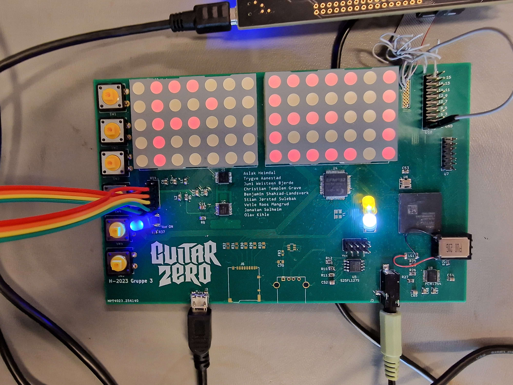

## The idea

Our concept was a game inspired by Guitar Hero, where the player plays notes corresponding with notes ”falling down” a led matrix. Whether or not the player successfully plays the beat, determines which notes are actually being played. The player is meant to control the lead instrument, resulting in this instrument not being played whenever the player fails to hit a note. The backing instruments are always played. From the menu, the player has the option to select between a handful of songs of varying difficulty.

## Technical Summary

The MCU controls the song flow, input from the user and the visual output. The MCU sends data over SPI to the FPGA containing the required information about which notes the FPGA should play. The FPGA receives this data, and generates an audio signal using a set of pre-made instruments which contain one or more voices. This signal is further passed on to a DAC using I2S. Finally, the DAC outputs the audio to the onboard speaker or the audio jack.

